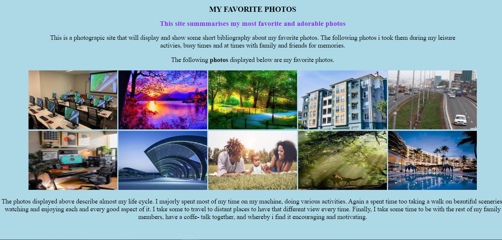

# Favorite Photos
This is a simple photographic web page including some photos and has a short bibliography.

You can have the link to the working implementation  here:
```
https://morrismutiso.github.io/project-02/
```


## Technologies

This project was created using the following:

1. HTML
2. CSS

## Pre-requisites
For one to run this web page, he or she, should have a minimum of the following resources:

- Linux / Windows / MacOs
- 2GB RAM
- 4GB Free space
- Any valid browser

## Setup
This section will guide you on how you can setup and run the web page on your machine.

1. Clone the repository to your *local* machine. On your computer open the `Terminal` (**Linux/MacOs**) or `GitBash`/`WSL` (**Windows**)

```
git clone: https://github.com/morrismutiso/project-02
```

2. Change into the working directory
```
cd project-02.readme
```

3. Open in visual studion code
```
code .
```

4. Run on the browser by opening it on live server.

### Screens 
You can have a good look on the following:



## Author 
This project was built and is maintained by:

- [morrismutiso](https://github.com/morrismutiso)

## Known issues
There are no known issues at the current moment.

## License
This wepbage has been distributed under the MIT License.

Copyright (c) 2012-2023 Scott Chacon and others

Permission is hereby granted, free of charge, to any person obtaining
a copy of this software and associated documentation files (the
"Software"), to deal in the Software without restriction, including
without limitation the rights to use, copy, modify, merge, publish,
distribute, sublicense, and/or sell copies of the Software, and to
permit persons to whom the Software is furnished to do so, subject to
the following conditions:

The above copyright notice and this permission notice shall be
included in all copies or substantial portions of the Software.

THE SOFTWARE IS PROVIDED "AS IS", WITHOUT WARRANTY OF ANY KIND,
EXPRESS OR IMPLIED, INCLUDING BUT NOT LIMITED TO THE WARRANTIES OF
MERCHANTABILITY, FITNESS FOR A PARTICULAR PURPOSE AND
NONINFRINGEMENT. IN NO EVENT SHALL THE AUTHORS OR COPYRIGHT HOLDERS BE
LIABLE FOR ANY CLAIM, DAMAGES OR OTHER LIABILITY, WHETHER IN AN ACTION
OF CONTRACT, TORT OR OTHERWISE, ARISING FROM, OUT OF OR IN CONNECTION
WITH THE SOFTWARE OR THE USE OR OTHER DEALINGS IN THE SOFTWARE.


